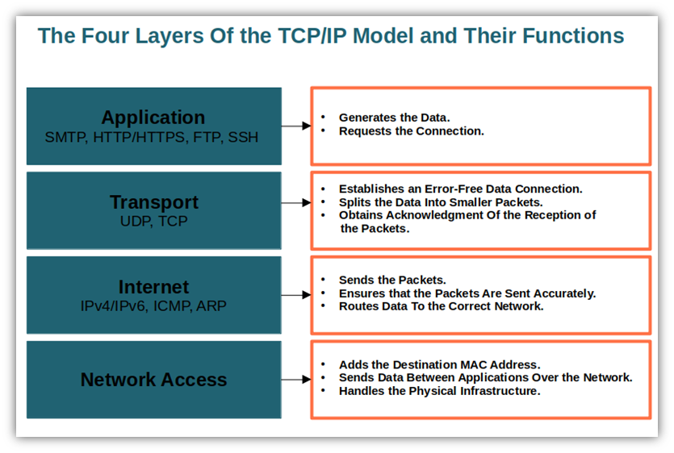
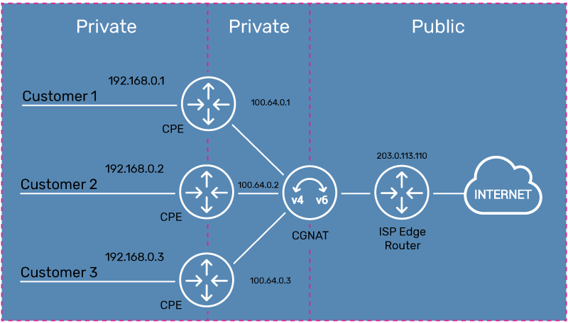

# Introducing Networks and Protocols

## OSI Layer model

## TCP/IP Layer model

## Internet Protocol

- IP(Internet Protocol) -> IPv4(32 bits addreses) and IPv6(128 bit addresses).

## What is an address?

- **loopback connection** -> establish connection to myself(localhost or 127.0.0.1).
- private ips ranges(10.0.0.0 -> 10.255.255.255, 192..., 172...)
- **Classles Inter-Domain Routing(CIDR)** ---> 10.0.0.0/8 --> 8 symbolizes the fixed number of bits --> there 10 is fixed and the others can vary.
- Same thing stand of IPv6 addresses, however we represent those into hexas.
- If interested sometimes, look into IPv6's **shortening rules**.

## Domain names

- **Domain Name System(DNS)** server has to solve the name(domain name) of the website into an ip.
- Resolving connection:
  - PC send an UDP message to DNS server asking for AAAA-type record of the domain, receiving an IPv6 if succesful, now the pc connects to the server pointed by that record. However, if that server is inaccesible the PC goes further and asks for an A-type record receiving an IPv4 address, which will again try to connect to. Usually both the A-type record and the AAAA-type record will point to the same server.

## Internet Routing

- **Internet Control Message Protocol(ICMP)** - used in commands like traceroute/tracert(Windows) in order to measure the time of a hop between two addreses. It can can be used fore repoting Erros, as a diagnostic tool or even to hurt network performance.

## Local addresses and address translation

- In order for a device to leave the local network, the router needs to translate the local ip of the device into the Router public IP and vice-versa when coming from outside the network, the router need to translate the request into the local ip.

## Multicast,broadcast and anycast

- One sender -> One recipient => **unicast**
- One sender -> all recipients => **broadcast**
- One sender -> any recipient => **anycast**

## Port numbers

- IPs help in identifying the device, further the ports enhance this by identifying the application that you are trying to reach.
- Ports have the form of 16 bits integers. (0 to 65535)
- Common port numbers: 20,21, 22, 23, 25, 80, 443, etc.

##  A socket

- uniquely defined by the following 5-tuple:
  - Local IP address.
  - Local port.
  - Remote IP address.
  - Remote port.
  - Protocol(UDP or TCP).

## My questions(**interesting most of the times**)

- Q: Can my own PC have an public IPv4 address? (not being behind a NAT).
- A: Usually multiple users can be connected to the same IP usign a CGNAT of the ISP in order to not exhaust IPv4 addreses.

- **CGNAT**
