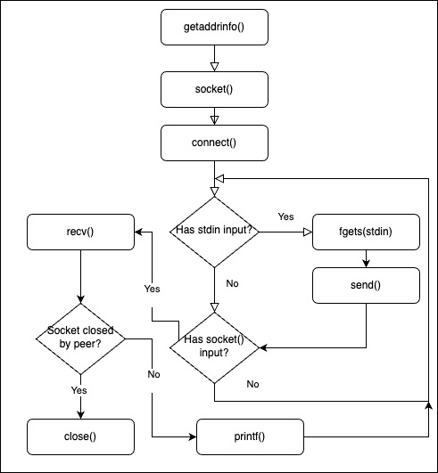
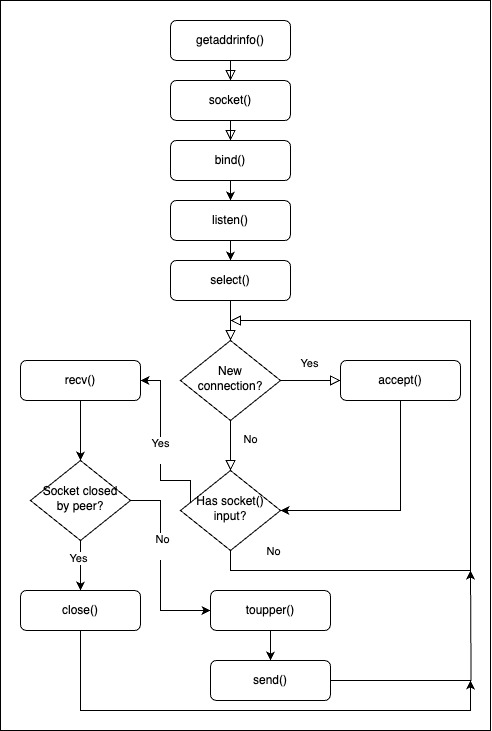

# An In-Depth Overview of TCP Connections

## Multiplexing TCP connections

- socket API is blocking by default, using accept() for an incoming connection, the program execution is blocked until a new connection is actually available.
- blocking on recv() is not acceptable, nor is blocking on the client side either.

## Polling non-blocking sockets

- sockets can be configured to use non-blocking operations.
- fctnl() with O_NONBLOCK flag for Unix based.
- ioctlsocket() with FIONBIO flag for Windows.
- resource hungry && hard to track --> not using pollin.

## Forking and multithreading

- starting new threads for each blocking operation(blocks only the current thread).
  - hard to share state.
  - different APIs on different platforms.
- Unix and MacOS:

```C
  while(1) {
    socket_client = accept(socket_listen, &new_client, &new_client_length);
    int pid = fork();
    if (pid == 0) { // child process
      close(socket_listen);
      recv(socket_client, ...);
      close(socket_client);
      exit(0);
    }
    // parent process
    close(socket_client);
  }
```

## The select() function

- given a set of sockets, tells which are ready to be read.
- it is portable between Berkley and Winsock.(Unix && Windows).

## Synchronous multiplexing with select()

- Select() blocks read on non ready sockets.
- can be configured to return after a specified time.
- can be configured to return if socket is ready or if there was an error.

```C
int select(int nfds, fd_set* readfds, fd_set& writefds,
    fd_set* exceptfds, struct timeval* timeout);

fd_set our_sockets;
FD_ZERO(&our_sockets);
FD_SET(socket_listen, &our_sockets);
FD_SET(socket_a, &our_sockets);
FD_SET(socket_b, &our_sockets);
```

- Sockets can be handled manually, however not using the given functions will break portability between Winsocks and Berkley sockets.

```C
SOCKET max_socket;
max_socket = socket_listen;
if ( socket_a > max_socket) max_socket = socket_a;
if ( socket_b > max_socket) max_socket = socket_b;

fd_set copy;
copy = our_sockets;
select(max_socket + 1, &copy, 0, 0, 0); // this blocks until at least 1 socket is ready

if(FD_ISSET(socket_listen, &copy)) {
  // socket_listen has a new connection...
  accept(socket_listen...
}

if(FD_ISSET(socket_a, &copy)) {
  // socket_a has a new connection...
  accept(socket_a...
}

if(FD_ISSET(socket_b, &copy)) {
  // socket_b has a new connection...
  accept(socket_b...
}
```

## Select() timeout

- last argument of select() function let us specify a timeout.
```C
  struct timeval {
    long tv_sec;
    long tv_usec;
  };

  struct timeval timeout;
  timeout.tv_sec = 1;
  timeout.tv_usec = 500000;
  select(max_socket + 1, &copy, 0, 0, &timeout);  // timeout after 1.5 seconds
```

## Iterating through an fd_set

- we can iterate through an fd_set using a for loop(starting at 1 because all SOCKET descriptors are positive numbers).

```C
  SOCKET i;
  for(i = 1; i <= max_socket; ++i) {
    if (FD_ISSET(i, &master)) {
      CLOSESOCKET(i);
    }
  }
```

## select() on non-sockets

- on Unix based, select() also work on file and terminal IO, however this does not work on Windows.

## A TCP client

- TCP client that connects to any TCP server.
  - takes hostname/IP
  - port
- If successful, relays data received from server to the terminal and data inputed in the terminal to the server.
- Stops when it is terminated(CTRL + C) or the server closes the connection.
- Diagram of TCP client:



## TCP client code

- look at tcp_client.c (also comments).

## TCP server

- Diagram on TCP server:



## TCP server code

- look at tcp_server_toupper.c(also comments).

## Building a chat room

- modify the tcp_server_toupper.c so that connected clients can send data between them.

### Blocking on send()

- When we call send(), it first copies the data in a buffer provided by the OS. If the buffer if full, it blocks until it has enough space to accept the data.
- we should check the return value of send for the possibility of it not sending all the data.
- example of code to sending data and handling the possibility that no the entire buffer is sent from the first try.

```C
  int begin = 0;
  while (begin < buffer_len)
  {
    int sent = send(peer_socket, buffer + begin, buffer_len - begin, 0);
    if (sent == -1)
    {
      //handle error
    }
    begin += sent;l
  }
```

## TCP is a stream protocol

- in TCP data is sent as a stream(e.g. you send() 25 bytes, however the receiver calls recv() and gets 5 bytes, then 10 and then 10 more)
- in some applications this could be problematic(you want received to close when it receives string 'quit', however you calling send(..., 'quit', ..) does not guarantee that he will read the entire string).
- a solution for this would be buffering data, until it is enough to be processed.