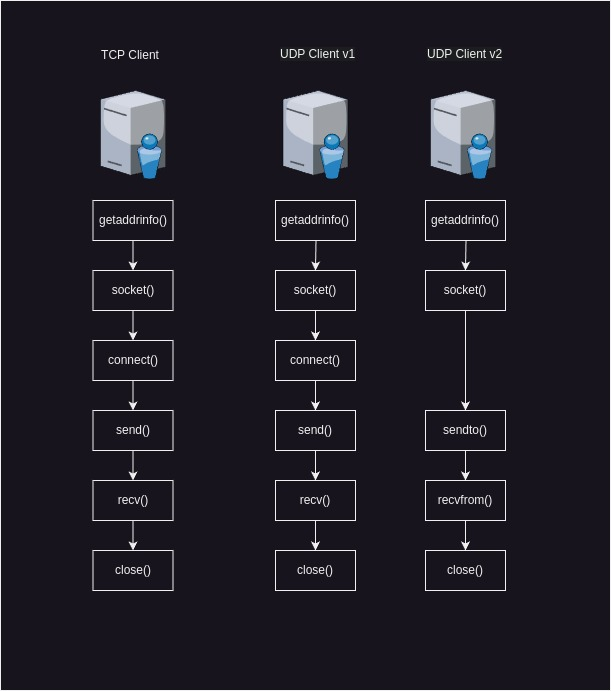
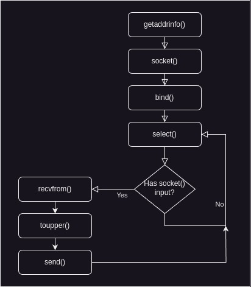

# Establishing UDP connections

## How UDP sockets differ

- Not many differences, for example we can change the tcp_client from chapter 3 and set hints.ai_socktype = SOCK_DGRAM and the client will work as expectedly.\
- they are bigger differences between TCP and UDP servers.

## UDP client methods

- in the TCP we need to call connect() to set the remote address and establish the TCP connection tu further call send() method.

```C
connect(tcp_socket, peer_address, peer_address_length);
send(tcp_packet, data, data_length, 0);
```

- in the case of UDP we can do the same thing, but we don't have too, because UDP is conectionless, therefore no connection is needed to be established before. We can use the sendto() and recvfrom() methods instead.


```C
sendto(udp_socket, data, data_length, 0, peer_address, peer_address_legnth);
```

- TCP vs UDP client flow diagram:



## UDP server methods

- TCP needs one sokcet for each connection, whereas UDP needs only one socket which can communicated with any number of peers.
- While TCP needs to use listen() and accept() functions in order to establish new connections, UDP does not use them.

- maybe diagram?? - page 108, describes the flow (differences explained before)

## A simple UDP server

- check udp_recvfrom.c

## A simple UDP client

- check udp_sendto.c

## A UDP server

- UDP server that can service many connections.
- see the below diagram.


