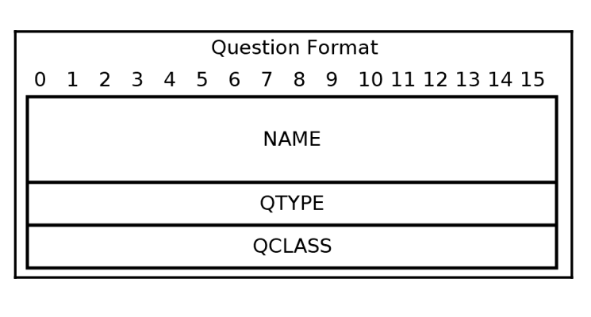

# Hostname resolution & DNS

## How hostname resolution works

- used to assign names to computer and systems connected to the internet.
- time that this link is retained by the OS in the local cache is called **TTL**(time to live).
- if a DNS server does not found the entry, it querries another DNS server an so on until it gets to the hostanme definition.

- Case, Client A's DNS tries to resolve **www.example.com**
  - it first connects to a root DNS and asks for www.example.com.
  - the root DNS server directs it to ask the .com server.
  - our client's DNS server then connects to the server responsible for .com and asks for www.example.com
  - the .com DNS server gives our server the address of another server, the example.com DNS server.
  - Our DNS finally connects to that server and asks about the record for www.example.com
  - The example.com shares the address of the www.example.com
  - Our client's DNS server relays it back to our client.

## DNS record types

- **Record Types**:
  - AAAA      -> IPv4
  - AAAA      -> IPv6
  - MX        -> mail server information
  - TXT       -> store information about domain(read about **SPF sender policy framework**)
  - CNAME(**canonical name**)     -> used for aliases(DNS server can respond with a CNAME record that points to the real site e.g. **www.example.com** and server responds with CNAME record pointing to **example.com**)
  - *(ALL/ANY) -> DNS server returns all known record types for the current querry.
  - **NB:**
    - there are many other record types in use.
    - one hostname can have multiple record types of the same type(e.g. a hostname having 5 different A records with different IPv4s)

## DNS security

- Domain Nmae System Security Extensions(**DNSSEC**)
  - DNS extensions providing data authentication.
  - This auth allows a DNS client to know that a given DNS reply is authentic, but does not protect against eavesdropping.
- DNS over HTTPS(**DoH**)
  - protocol that provides name resolution over HTTPS.
  - HTTPS provides strong security guarantees, including resistance to interception.

## Name/address translation functions

- it is common to need to translate text-based representatives of an address or hostname into an address structure required by the socket programming API.
- so far used **getaddrinfo()** because it is the most portable across OSs.
- to convert a binary address back into a text format we can use **getnameinfo()**

## Using getaddrinfo()

```c
  int getaddrinfo(const char* node,             // hostname/address as a string
                  const char* service,          // a service/port number as a string
                  const struct addrinfo* hints,
                  struct addrinfo** res);
```

```c
struct addrinfo {
               int              ai_flags;
               int              ai_family;
               int              ai_socktype;
               int              ai_protocol;
               socklen_t        ai_addrlen;
               struct sockaddr *ai_addr;
               char            *ai_canonname;
               struct addrinfo *ai_next;
           };
```

- **ai_flags** - This field specifies additional options, described below.  Multiple flags  are  specified  by
bitwise OR-ing them together.
  - possible values:
    - **AI_NUMERICHOST** --> prevents name lookups.
    - **AI_NUMERICSERV** --> accepts only port numbers, rejects service names.
    - **AI_ALL**         --> can be used to request both IPv4 & IPv6.
    - **AI_ADDRCONFIG**  --> returns only addresses that match the family type of a configured interface on the local machine.(e.g. my machine is IPv4 exlusively configured, then no IPv6 will be returned).
    - **AI_PASSIVE**    --> can be used with node = 0 to request **wildcard addresses**(the local address that accepts connections on anty of the host's network addresses).
- **ai_family** - This field specifies the desired address family for the returned addresses.  Valid values for
this  field  include  AF_INET and AF_INET6.  The value AF_UNSPEC indicates that getaddrinfo()
should return socket addresses for any address family (either IPv4 or IPv6, for example) that
can be used with node and service.
  - possible values:
    - **AF_INET**
    - **AF_INET6**
    - **AF_UNSPEC**
- **ai_socktype** - This field specifies the preferred socket type, for example SOCK_STREAM or SOCK_DGRAM.  Spec‐
ifying 0 in this field indicates that socket addresses of any type can be returned by  getad‐
drinfo().
  - possible values:
    - **SOCK_STREAM** --> TCP
    - **SOCK_DGRAM**  --> UDP
    - 0 indicates that both can be used.
- **ai_protocol** -
This  field  specifies  the protocol for the returned socket addresses.  Specifying 0 in this
field indicates that socket addresses with any protocol can be returned by getaddrinfo().


- Example of using getaddrinfo() to find the address(es) for example.com:

```c
struct addrinfo hints;
memset(&hints, 0, sizeof(hints));
hints.ai_flags = AI_ALL;
struct addrinfo* peer_address;
if (getaddrinfo("example.com", 0, &hints, &peer_address))
{
  fprintf(stderr, "getaddrinfo() failed. (%d)\n", GETSOCKETERRNO());
  return 1;
}

// looping through results
struct addrinfo* address = peer_address;
do {
  // do something with the address.
} while((address = address->ai_next));

// finished using peer_address
freeadrinfo(peer_address);
```

## Using getnameinfo()

```c
  int getnameinfo(const struct sockaddr* addr, socklen_t addrlen,
                  char* host, socklen_t hostlen,
                  char* serv, socklen_t servlen, int flags);
```

- flag values:
  - **NI_NAMEREQD** --> requires getnameinfo() to return hostname and not address;
  - **NI_DGRAM**    --> specifies that the service is UDP-based and not TCP.
  - **NI_NUMERICHOST** --> returns IP instead of hostname.
  - **NI_NUMERICSERV** --> returns port number and not service name.

- example of using the function:

```c
char host[100], serv[100];
getnameinfo(address->ai_addr, address->ai_addrlen.
            host, sizeof(host),
            serv, sizeof(serv), 0);

printf("%s %s\n", host, serv);
```

- Reverse DNS done in the snippet before, asking which hostname matches the ip address;
- we can use NI_NUMERICHOST | NI_NUMERICSERV if we want the IP address instead of the hostname.

## IP lookup example program

- lookup.c

## The DNS protocol

- clients want to resolve a hostname/IP address
  - sends a DNS Query to a DNS server.
  - using port 53 over UDP usually.
  - DNS server performs the lookup and responds if possible.

  

- if the query/more commonly the answer is too big to fit into 1 UDP packet, then the query can be performed over TCP(TCP fallback/ DNS transport over TCP).
- client must know at least one DNS address.

## DNS message format


## DNS message header format

- size of the header is **12 bytes**
- it contains 13 fields

   - **ID** - any 16 bit value used to identify the DNS message(used to match client query with DNS server response)
   - **QR** - 1-bit field, 0 indicates a DNS query and 1 indicates a DNS response.
   - **Opcode** 4-bit field, indicating type of query
   - **AA** - indicates authoritative answer
   - **TC** - indicated that the message was truncated, should be resent using TCP.
   - **RC** - should be set if recursion is desired. DNS server can contact additional server to come up with an answer.
   - **RA** - indicates whether the DNS server supports recursion.
   - **Z** - unused and should be set to 0.
   - **RCODE** - is set into a DNS response to indicate the error condition.
   - **QDCOUNT, ANCOUNT, NSCOUNT, ARCOUNT** - indicate the number of records in their respective sections(questions in DNS query, Answers in DNS response).

## Question format



- **QTYPE** - indicate the record type we are asking for.
- **QCLASS** - should be set 1 for internet.
- the name field involves a special encoding. First, a hostname should be broken up into its individual labels.

- Encoding for www.example.com:


- if the QTYPE and QCLASS fields were appended, then it could make up an entire DNS question.
- a DNS response is sometimes required to repeat the same name multiple times.

## Answer format

- **NAME**
- 2 16-bit fields, **TYPE & CLASS**.
- 32-bit field, **TTL(time to-live, seconds that a response is allowed to be cached)**
- 16-bit length specifier, **RDLENGTH**
- length field is followed by **RDATA** begin RDLENGTH long.


## Endianess

- forrmat of a DNS message is in **big-endian(network byte order)**.
  - e.g. number 999 does not fit 1 byte, it is 2 bytes
  - 999 = 0x03E7, the network will send it like 2 bytes: 0x03 and 0xE7, not the other way around as in little-endian.

## A simple DNS query

- should put an arbitrary number in ID, set the RD bit to 1 and set QDCOUNT to 1.
- add a question after the header. That data should be sent as an UDP packet.
```c
  char dns_query[] =
  {
    0xAB, 0xCD,                                 /* ID */
    0x01, 0x00,                                 /* Recursion */
    0x00, 0x01,                                 /* QDCOUNT */
    0x00, 0x00,                                 /* ANCOUNT */
    0x00, 0x00,                                 /* NSCOUNT */
    7, 'e', 'x', 'a', 'm', 'p', 'l', 'e',       /* label */
    3, 'c', 'o', 'm',                           /* label */
    0,                                          /* End of name */
    0x00, 0x01,                                 /* QTYPE = A */
    0x00, 0x01                                  /* QCLASS */
  };
```

## Printing a DNS message name

- look at dns_query.c, function called print_name.

