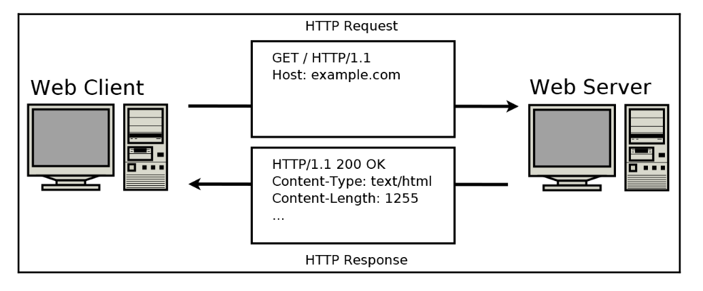
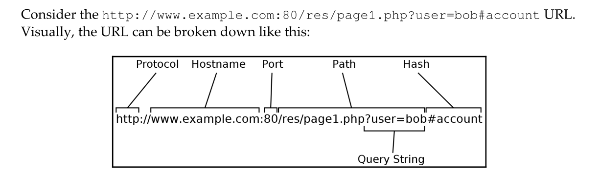

# Building a simple Web Client

- **Hypertext Transfer Protocol(HTTP)** - the protocol that power the world wide web

## The HTTP Protocol

- text-based client-server protocol that runs over HTTP, plain HTTP running on port 80.
- plain HTTP has been deprecated for security reasons, should use HTTPS which is running on port 443.

- how does http protocol works:
  - the web client sends a HTTP request to the web server.
  - then, the web server responds with a HTTP response.


## HTTP request types

- **GET** - client wants to download a resource.
- **HEAD** - clients wants to know information about a resurce(e.g. size).
- **POST** - client wants to send information to the server(e.g. a form completed online)
- some more reuest type:
  - **PUT** - used to send a document to the web server.
  - **DELETE** - request the web server to delete a document/resource.
  - **TRACE** - used to request diagnostic information from web proxies. However, most web web proxies do not support TRACE, therefore it's rarely used.
  - **CONNECT** - Used to initiate an HTTP connection though a proxy server.
  - **OPTIONS** - used to ask which HTTP request types are support by the web server for a certain document/resource. Rarely used!!!!

## HTTP request format

- going to [example_get](http://www.example.com/pag1.htm) will send an HTTP request that looks like:

```
GET /pag1.htm HTTP/1.1          // request line
Host: www.example.com
User-Agent: Mozilla/5.0 (X11; Ubuntu; Linux x86_64; rv:129.0) Gecko/20100101 Firefox/129.0
Accept: text/html,application/xhtml+xml,application/xml;q=0.9,image/avif,image/webp,image/png,image/svg+xml,*/*;q=0.8
Accept-Language: en-US,en;q=0.5
Accept-Encoding: gzip, deflate
Connection: keep-alive
Upgrade-Insecure-Requests: 1
Priority: u=0, i
```


## HTTP response format

```
HTTP/1.1 404 Not Found
Content-Encoding: gzip
Accept-Ranges: bytes
Age: 238717
Cache-Control: max-age=604800
Content-Type: text/html; charset=UTF-8
Date: Sun, 01 Sep 2024 13:05:54 GMT
Expires: Sun, 08 Sep 2024 13:05:54 GMT
Last-Modified: Thu, 29 Aug 2024 18:47:17 GMT
Server: ECAcc (dcd/7D69)
Vary: Accept-Encoding
X-Cache: 404-HIT
Content-Length: 648
```

## HTTP response codes

- 200 Range:
  - **200 OK** - client's request is succesfull and the server sends the requested resource.
- 300 Range:
  - **301 Moved Permanently** - the requested resource has moved to a new location, this location is indicated by the server in the Location header.
  - **307 Moved Temporarily** - the requested resource has moved to a new location, same indicated by the location header, future requests should use the original location.
- 400 Range:
  - **400 Bad Request** - The server doesn't understand/support the client's request.
  - **401 Unauthorized** - The client isn't authorized for the requested resource.
  - **403 Forbidden** - The client is forbidden to access the requested resource.
- 500 Range:
  - **500 Internal Server error**: - the server encountered an error while tying to fulfill the client's request.

## Response body length

- HTTP server can include Content-Length header in the response.
- Transfer-Encoding: chunked header can also be used if the server wants to start transmiting data before its size.

```
HTTP/1.1 200 OK
Content-Type: text/plain; charset-ascii
Transfer-Encoding: chunked

44
Lorem ipsum..
37
LOrem altcefva..
0
```

## What's in an URL

- **Uniform Resource Locators(URLs)** - also known as web addreses, provide a convenient way to specify particular web resources.


- Parsing http://www.example.com:80/res/page1.php?user=bob#account:
  - **http://** - the part before :// indicates the protocol, it could be ftp or https etc.
  - **www.example.com** - this specifies the hostname, solved to resolve the IP address.
  - **:80** - the port number can be specified explictly by using a colon after the hostname, if not it uses the default ones, 80 for http, 443 for https, etc.
  - **/res/page1.php?user=bob** - this specifies the document path. The HTTP server makes a distinction between the part before and after the question mark, but the HTTP client should not assign significance to this. THe part after the question mark is often called the **query string**.
  - **#account** - this is called the hash, it specifies the position within a document, and the hash is not sent to the HTTP server. It instead allows a browser to scroll to aprticular part of a document after the entire document is received from the HTTP server.

## Parsing an URL

- look in code at parse_url function in web_get.c file.

## Implementing a web client

- same as before, but look at send_request & connect_to_host.

