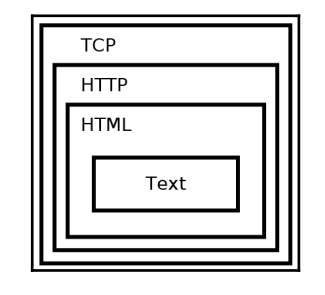

# Loading secure web pages with HTTPS and OpenSSL

## HTTPS Overview

- HTTPS secures HTTP using **TLS over TCP on port 443**.
- **TLS** is the successor to **SSL**(Secure Socket Layer)
- Protocol security criterias:
  - **Authentication**: need a way to prevent impostors from posing as legitimate communication partners. TLS provides peer auth methodfs for this reason.
  - **Encryptipn**: TLS uses encryption to obfuscate transmitted data. This prevents an eavesdropper from corectly interpreting intercepted data.
  - **Integrity**: TLS also ensures that the received data has not been tempered with or otherwise forged.

- HTTP is encapsulated in the following order : TCP -> HTTP -> HTML -> Text

- HTTPS also has the TLS between TCP and HTTP.

## Encryption basics

- no need, Groza took care of it.

## How TLS uses ciphers

- digital signatures are essential in TLS; they are used to auth servers.
- when a TLS connection is first established, the TLS client sends a list of preferred cipher suites to the server. The TLS server will select one of those, if the server does not support any of the clients cipher suites, thne the connection will not be established.

## The TLS protocol

- The **TLS handshake**
  - client sends a number of specs to the server such as SSL/TLS versions, cipher suites and compression methods to be used.
  - the server selects the highest mutually supported version of SSL/TLS and same for the rest.
  - after the basic setup is done, the server sends the client its certificate, being used by the client to verify that it's connected to a legitimate server.
  - once the client has verified the identity of the server, key exchange is being initiated.
  - once the key exchange is over, both will have a shared secret key and all further communcation will be encrypted using that key and the chosen symmetric encryption algorithm.

## Certificates

- each HTTPS server uses one or more certificates to verify their identity.
- this certificate must be trusted either by the client or by a third party that the client trusts.
- some popular **CAs(Certificate Authorities)**: IdenTrust, Comodo, DigiCert, GoDaddy, GlobalSign.

## Server name identification

- Many server host multiple domains, certificates are tied to domains. Therefore, TLS must provide a method for the client to specify which domain it's connecting to.
- TLS connection should be established before any HTTP data is sent, this is accomplished using **Server name identification(SNI)**, a techinique that requires the client to indicate to the server which domai  it is attempting to connect to. The server can then find a matching certificate to use for the TLS connection.

## OpenSSL

- about lib and how to find the version on your pc, check openssl_version.c

## Encrypted sockets using OpenSSL

- basic information and code, consult the book if ever need be(probably not).

## A simple HTTPS client

- code available in https_simple.c

## Notes

- TLS works only for TCP connections, use DTLS for UDP ones, OpenSSL supports both.
